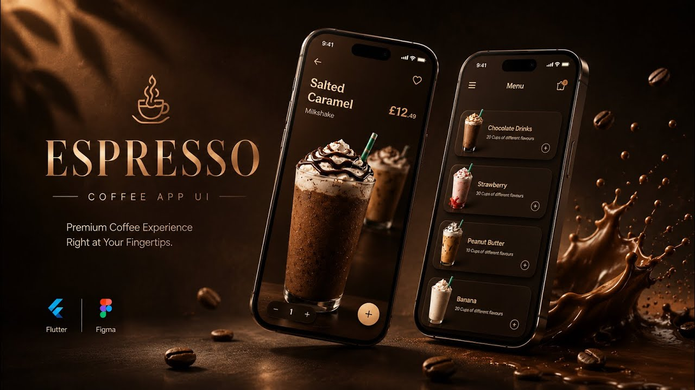
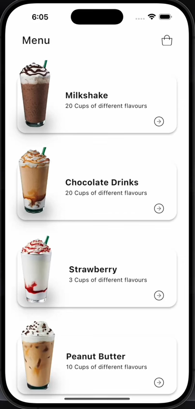
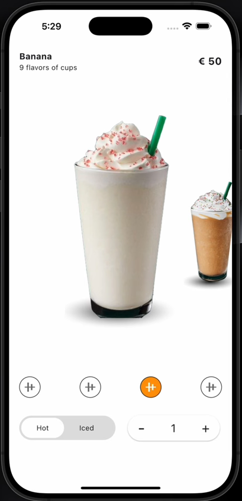

# ☕ Premium Coffee App

<p align="center">
  
</p>

<div align="center">

## ✨ A Premium Coffee Experience Built with Flutter

☕ Premium Coffee App is a modern Flutter application with an elegant coffee-inspired UI. ✨ Explore coffee collections, 🛍️ view product details, 🎨 enjoy smooth animations, and experience a clean responsive design built with Flutter & Dart. 🚀


</div>

---

# 📌 Overview

**Premium Coffee App** is a modern Flutter application designed to deliver a stylish and enjoyable coffee browsing experience.

The application allows users to explore premium coffee products through an attractive interface, beautiful banners, and detailed product pages with a clean and elegant design.

The project focuses on creating:

- ☕ Premium coffee-inspired UI
- 🎨 Modern and clean user interface
- ⚡ Smooth animations and transitions
- 🧩 Reusable Flutter components
- 📱 Responsive layouts
- ✨ High-quality user experience

---

# ✨ Features

## 🏠 Home Screen

- Beautiful coffee-focused home interface.
- Displays featured coffee products.
- Modern cards and attractive layouts.
- Easy navigation throughout the app.

## 🎯 Details Screen

- Displays complete coffee product information.
- Large product images.
- Organized details section.
- Premium product presentation.

## 🖼️ Banner Section

- Eye-catching promotional coffee banners.
- Highlights featured products and offers.
- Reusable banner components.

## 🚪 Lobby Screen

- Elegant introduction screen.
- Creates a premium first impression.
- Smooth entry experience for users.

## ☕ Coffee Experience

- Designed for coffee lovers.
- Focused on simplicity and elegance.
- Premium visual style inspired by coffee brands.

---

# 📱 Screenshots

## 🏠 Home

<p align="center">

</p>

---

## ☕ Details

<p align="center">

</p>

---

## 📂 Project Structure

```
lib/
├── core/
│   ├──DI
│   ├──Networking
│   ├──Routing
│   ├──Helpers
│   ├──Theming
│   ├── Widgets
│   ├── 
├── features/
│   ├── home/
│   │   ├── data
│   │   ├── logic
│   │   ├── ui
│   ├── authentication/
│   ├── appointments/
│   ├── profile/
│   └── doctors/
├── shared/
└── main.dart

```

---

# 🛠️ Technologies Used

| Technology | Description |
|------------|-------------|
| Flutter | Cross-platform application framework |
| Dart | Programming language |
| Material Design | Modern UI design system |

---

# 🚀 Installation & Running

## Requirements

Make sure you have installed:

- Flutter SDK
- Dart SDK
- Android Studio or VS Code
- Android Emulator or Physical Device

---

## 🤝 Contributing

Contributions are welcome.

Fork the repository, create a feature branch, and submit a Pull Request.

---

## 📄 License

This project is licensed under the MIT License.

---

## 👨‍💻 Author

**Amir Yousry**

Flutter Developer

GitHub: https://github.com/amir-yousry

---

⭐ If you find this project useful, consider giving it a star.

## Clone Repository

```bash
git clone https://github.com/your-username/premium_coffee_app.git
